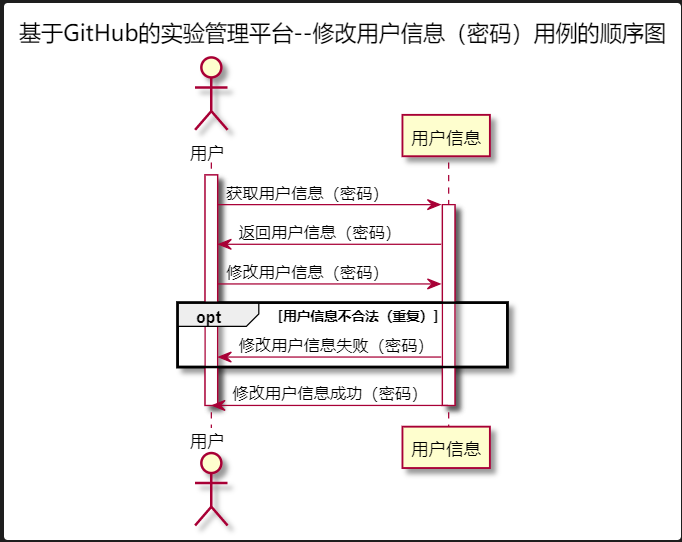


# “修改用户信息”用例 [返回](../README.md)
## 1. 用例规约

|用例名称|修改用户信息|
|-------|:-------------|
|功能|修改用户的GitHub用户名称|
|参与者|学生，老师|
|前置条件|必须先登录，并且查看用户现有的GitHub用户名|
|后置条件| |
|主事件流| 1.用户填写GitHub用户名称   2.用户提交修改信息（密码）  3.系统存储修改后的GitHub用户名称|
|备选事件流|1a. 如果用户输入的GitHub用户名称为空  &nbsp;&nbsp; 1.系统清空用户的GitHub用户名称|
# 2. 业务流程（顺序图） [源码](../src/sequence修改用户信息（密码）.puml)
 

## 3. 界面设计
- 界面参照:[修改用户信息.html](https://github.com/LiYundong593/is_analysis/tree/master/test6/修改用户信息（密码）.html)
- API接口调用
    - 接口1：[getUserInfo](../接口/getUserInfo.md)
    - 接口2：[setUserInfo](../接口/setUserInfo.md)
    

