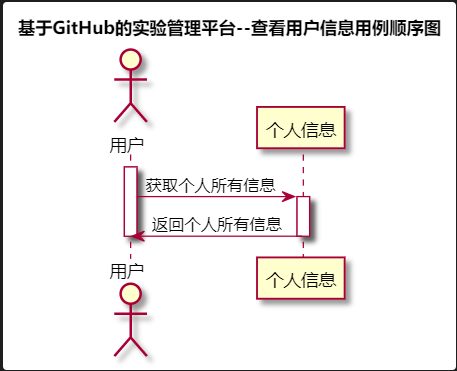

# “查看用户信息”用例 [返回](../README.md)
## 1. 用例规约

|用例名称|查看用户信息|
|-------|:-------------|
|功能|查看个人的基本信息|
|参与者|学生，老师|
|前置条件|必须先登录|
|后置条件| |
|主事件流| |
|备选事件流| |

## 2. 业务流程（顺序图） [源码](../src/sequence查看用户信息.puml)
 

## 3. 界面设计
- 界面参照:[查看用户信息.html](https://github.com/LiYundong593/is_analysis/tree/master/test6/查看用户信息.html)
- API接口调用
    - 接口1：[getUserInfo](../接口/getUserInfo.md)

